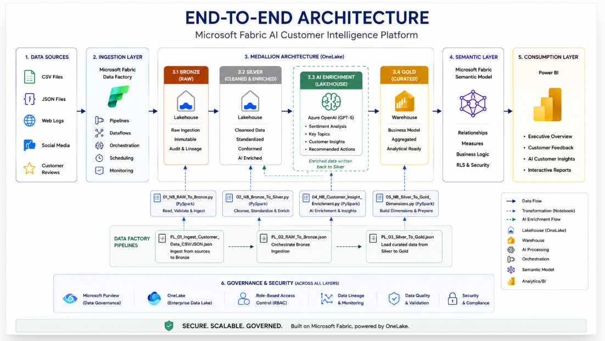

# 🚀 Fabric AI Customer Intelligence Platform

> **An enterprise-grade end-to-end Microsoft Fabric analytics solution** implementing Medallion Architecture, AI-powered customer intelligence, dimensional data warehousing, and interactive Power BI reporting.

The **Fabric AI Customer Intelligence Platform** demonstrates how modern organizations can build a scalable customer analytics platform using **Microsoft Fabric**, integrating **Data Engineering**, **Artificial Intelligence**, **Data Warehousing**, **Business Intelligence**, and **DevOps** into a unified enterprise solution.

The solution follows Microsoft's recommended **Medallion Architecture**, leveraging **Fabric Data Factory**, **OneLake**, **PySpark**, **Azure AI Foundry (GPT-5)**, **Fabric Warehouse**, **Power BI Semantic Models**, and **Deployment Pipelines** to transform raw operational data into trusted business insights.

---

## ⭐ Enterprise Solution Highlights

- Enterprise Medallion Architecture (Bronze → Silver → Gold)
- Microsoft Fabric Data Factory orchestration
- OneLake centralized data platform
- PySpark data engineering & feature engineering
- AI-powered customer review enrichment using GPT-5
- Enterprise Galaxy Schema data warehouse
- Power BI Semantic Model
- Executive and operational dashboards
- Multi-environment deployment (Development → Test → Production)
- Azure DevOps & GitHub integration
- Modular and production-ready repository structure

---

# 📌 Project Overview

Organizations generate customer information across multiple operational systems including sales transactions, product catalogs, customer reviews and digital interactions.

The **Fabric AI Customer Intelligence Platform** consolidates these data sources into a governed analytics platform where AI-generated insights are integrated directly into the engineering pipeline before being delivered through interactive Power BI dashboards.

The solution demonstrates enterprise architecture principles including:

- Layered Medallion Architecture
- Modular data pipelines
- AI-enhanced analytics
- Enterprise data warehousing
- Semantic modelling
- Multi-environment deployment

---

# 🏗 Solution Architecture

```markdown

```

For a detailed explanation of the solution architecture, see:

📖 **docs/architecture.md**

---

# 🛠 Enterprise Technology Stack

| Layer | Technology |
|---------|------------|
| Data Integration | Microsoft Fabric Data Factory |
| Storage | OneLake |
| Bronze Layer | Fabric Lakehouse |
| Silver Layer | Fabric Lakehouse |
| Data Processing | PySpark |
| AI Enrichment | Azure AI Foundry (GPT-5) |
| Gold Layer | Fabric Warehouse |
| Data Warehouse | Galaxy Schema |
| Semantic Layer | Power BI Semantic Model |
| Reporting | Power BI |
| DevOps | GitHub & Azure DevOps |
| Deployment | Microsoft Fabric Deployment Pipelines |

---

# ✨ Solution Features

- End-to-end Medallion Architecture
- Enterprise ETL orchestration
- AI-powered customer review enrichment
- Feature engineering with PySpark
- Enterprise dimensional modelling
- Galaxy Schema semantic model
- Interactive Power BI dashboards
- Environment promotion using Deployment Pipelines
- Production-ready repository organization

---

# 📊 Dashboard Gallery

### 📈 Executive Overview

> *(Insert Screenshot)*

---

### 👥 Customer Feedback

> *(Insert Screenshot)*

---

### 🤖 AI Customer Insights

> *(Insert Screenshot)*

---

# 📂 Repository Structure

```text
fabric-ai-customer-intelligence/
│
├── architecture/
├── config/
├── docs/
├── notebooks/
├── pipelines/
├── powerbi/
├── sample-data/
├── screenshots/
├── sql/
└── README.md
```

---

# 📚 Documentation

Detailed technical documentation is available in the **docs** folder.

| Document | Description |
|-----------|-------------|
| architecture.md | End-to-End Solution Architecture |
| semantic-model.md | Galaxy Schema & Semantic Model |
| ai-enrichment.md | GPT-5 Enrichment Workflow |
| deployment.md | Deployment Strategy |
| cicd.md | CI/CD & DevOps Approach |

---

# 🚀 Future Enhancements

- Incremental data ingestion
- Event streaming
- Customer churn prediction
- Product recommendation engine
- RAG-powered customer support assistant
- Enterprise Git Integration
- Automated CI/CD pipelines

---

# 💼 Skills Demonstrated

- Microsoft Fabric
- Fabric Data Factory
- OneLake
- Medallion Architecture
- PySpark
- Delta Lake
- Azure AI Foundry
- GPT-5 Integration
- Prompt Engineering
- SQL
- Data Warehousing
- Galaxy Schema
- Semantic Modelling
- Power BI
- Deployment Pipelines
- Azure DevOps
- GitHub

---

# 👨‍💻 Author

**Ousainou Panneh**

**Data Engineer | BI Developer | Microsoft Fabric | AI & Data Science**
