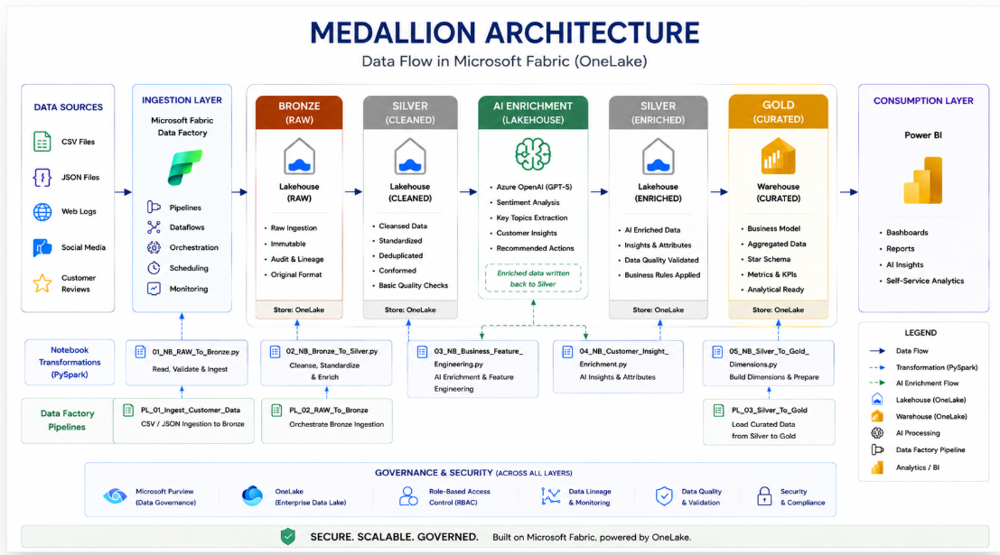
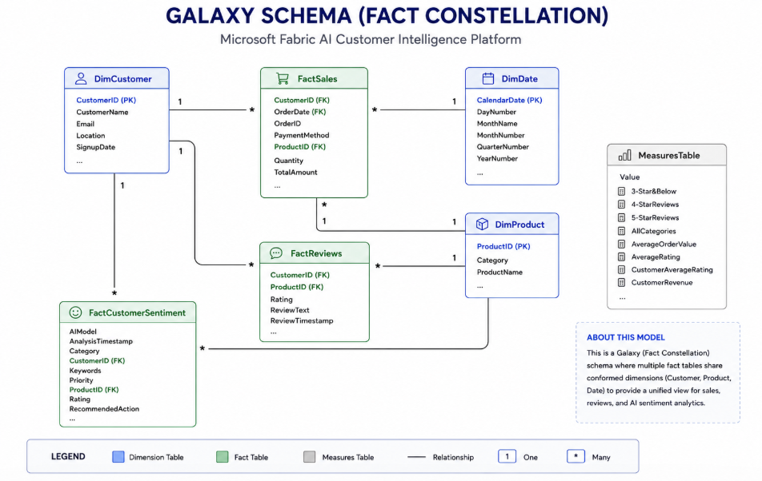

# 🚀 Fabric AI Customer Intelligence Platform

> **An enterprise-grade end-to-end Microsoft Fabric analytics solution** implementing Medallion Architecture, AI-powered customer intelligence, dimensional data warehousing, and interactive Power BI reporting.

The **Fabric AI Customer Intelligence Platform** demonstrates how modern organizations can build a scalable customer analytics platform using **Microsoft Fabric**, integrating **Data Engineering**, **Artificial Intelligence**, **Data Warehousing**, **Business Intelligence**, and **DevOps** into a unified enterprise solution.

The solution follows Microsoft's recommended **Medallion Architecture**, leveraging **Fabric Data Factory**, **OneLake**, **Lakehouse**, **PySpark**, **Azure AI Foundry (GPT-5)**, **Fabric Warehouse**, **Power BI Semantic Models**, and **Deployment Pipelines** to transform raw operational data into trusted business insights.

---

## ⭐ Enterprise Solution Highlights

- Enterprise Medallion Architecture (Bronze → Silver → Gold)
- Microsoft Fabric Data Factory orchestration
- OneLake centralized data platform
- Lakehouse-based data engineering
- PySpark feature engineering
- AI-powered customer intelligence using Azure AI Foundry (GPT-5)
- Enterprise dimensional warehouse using a Galaxy Schema
- Power BI Semantic Model
- Executive and operational dashboards
- Multi-environment deployment (Development → Test → Production)
- Azure DevOps & GitHub integration
- Modular, scalable and production-ready repository structure

---

# 📌 Project Overview

Organizations generate customer information across multiple operational systems including sales transactions, product catalogs, customer reviews and digital interactions.

The **Fabric AI Customer Intelligence Platform** consolidates these data sources into a governed analytics platform where AI-generated insights are integrated directly into the engineering pipeline before being delivered through interactive Power BI dashboards.

The solution demonstrates enterprise architecture principles including:

- Layered Medallion Architecture
- Modular data pipelines
- AI-enhanced analytics
- Enterprise data warehousing
- Semantic modelling
- Multi-environment deployment

---

# 🏗️ End-to-End Solution Architecture

The platform orchestrates data ingestion, transformation, AI enrichment,
analytical modelling and reporting through Microsoft Fabric.

<p align="center">
  
</p>

📖 **Detailed Architecture:** [docs/architecture.md](docs/architecture.md)

---

# 🥉 Medallion Architecture

The solution follows Microsoft's Medallion Architecture to progressively
improve data quality through Bronze, Silver and Gold layers. Customer reviews
are enriched using Azure AI Foundry (GPT-5) before being promoted to the Gold
analytical layer.

<p align="center">
  
</p>

---

# 🌌 Enterprise Semantic Model

The Gold analytical layer is implemented using a **Galaxy Schema (Fact Constellation)** with shared dimensions, multiple fact tables and a governed Power BI Semantic Model.

<p align="center">
  
</p>

---

# 🛠 Enterprise Technology Stack

| Layer | Technology |
|---------|------------|
| Data Integration | Microsoft Fabric Data Factory |
| Storage | OneLake |
| Bronze Layer | Fabric Lakehouse |
| Silver Layer | Fabric Lakehouse |
| Data Processing | PySpark |
| AI Enrichment | Azure AI Foundry (GPT-5) |
| Gold Layer | Fabric Warehouse |
| Data Warehouse | Galaxy Schema |
| Semantic Layer | Power BI Semantic Model |
| Reporting | Power BI |
| Version Control | GitHub & Azure DevOps |
| Deployment | Microsoft Fabric Deployment Pipelines |

---

# ✨ Solution Features

- End-to-end Medallion Architecture
- Enterprise ETL orchestration
- AI-powered customer intelligence
- PySpark feature engineering
- Enterprise dimensional modelling
- Galaxy Schema semantic model
- Interactive Power BI dashboards
- Environment promotion using Deployment Pipelines
- Production-ready repository organization

---

# 📊 Dashboard Gallery

## 📈 Executive Overview

<p align="center">
  
</p>

---

## 👥 Customer Feedback

<p align="center">
  
</p>

---

## 🤖 AI Customer Insights

<p align="center">
  
</p>

---

# 🎯 Business Outcomes

This solution demonstrates how Microsoft Fabric can be used to build an enterprise-grade analytics platform that:

- Consolidates multi-source customer data
- Improves data quality through Medallion Architecture
- Enhances customer insights using Generative AI
- Delivers governed analytics through a semantic model
- Supports executive decision-making through interactive dashboards

---

# 📂 Repository Structure

```text
fabric-ai-customer-intelligence/
│
├── architecture/         # Architecture diagrams
├── config/               # Configuration files
├── docs/                 # Technical documentation
├── notebooks/            # PySpark notebooks
├── pipelines/            # Fabric Data Factory pipelines
├── powerbi/              # Semantic model & reports
├── sample-data/          # CSV & JSON sample datasets
├── screenshots/          # Dashboard screenshots
├── sql/                  # Warehouse DDL, Views & Stored Procedures
├── README.md
└── LICENSE
```

---

# 📚 Documentation

Comprehensive technical documentation is available in the **docs** folder.

| Document | Description |
|-----------|-------------|
| [architecture.md](docs/architecture.md) | End-to-End Solution Architecture |
| [semantic-model.md](docs/semantic-model.md) | Galaxy Schema & Semantic Model |
| [ai-enrichment.md](docs/ai-enrichment.md) | Azure AI Foundry (GPT-5) Enrichment Workflow |
| [deployment.md](docs/deployment.md) | Deployment Strategy |
| [cicd.md](docs/cicd.md) | DevOps & CI/CD Approach |

---

# 🚀 Future Enhancements

- Incremental data ingestion
- Enterprise Git integration
- Automated CI/CD pipelines
- Event streaming
- Customer churn prediction
- Product recommendation engine
- RAG-powered customer support assistant

---

# 💼 Skills Demonstrated

- Microsoft Fabric
- Fabric Data Factory
- OneLake
- Lakehouse
- Medallion Architecture
- PySpark
- Delta Lake
- Azure AI Foundry
- GPT-5 Integration
- Prompt Engineering
- SQL
- Data Warehousing
- Galaxy Schema
- Semantic Modelling
- Power BI
- Deployment Pipelines
- Azure DevOps
- GitHub

---

# 👨‍💻 Author

**Ousainou Panneh**

**Data Engineer | Business Intelligence Developer | Microsoft Fabric | AI & Data Science**

---

⭐ *If you found this project interesting, feel free to star the repository or connect with me on LinkedIn.*
