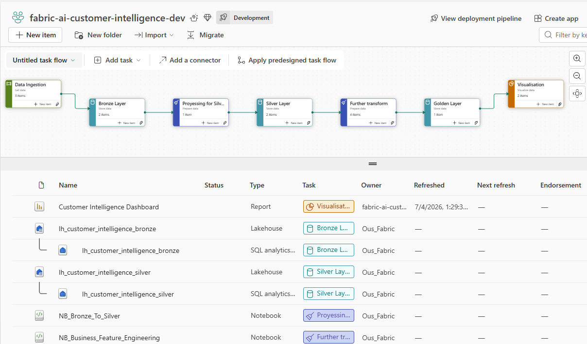
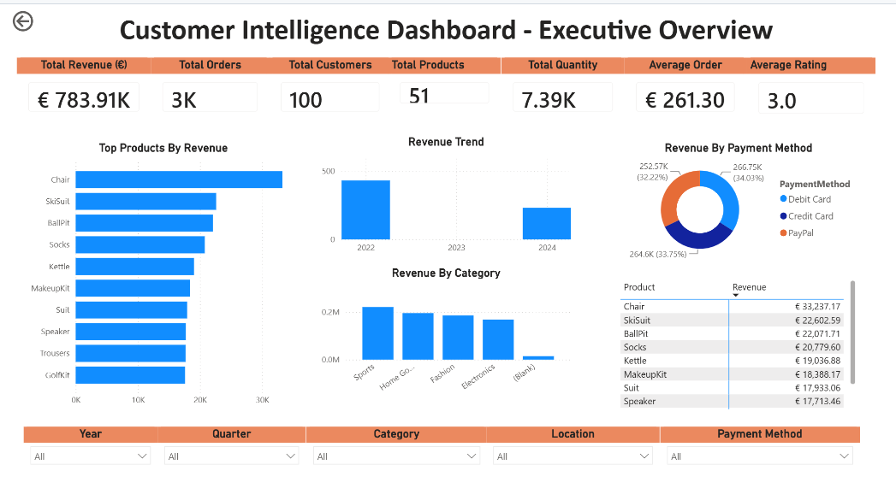
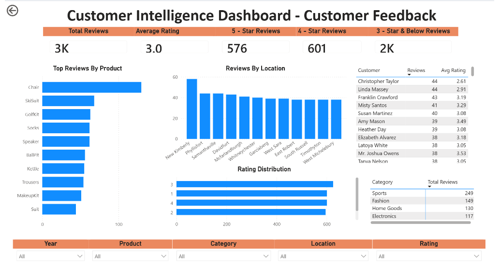
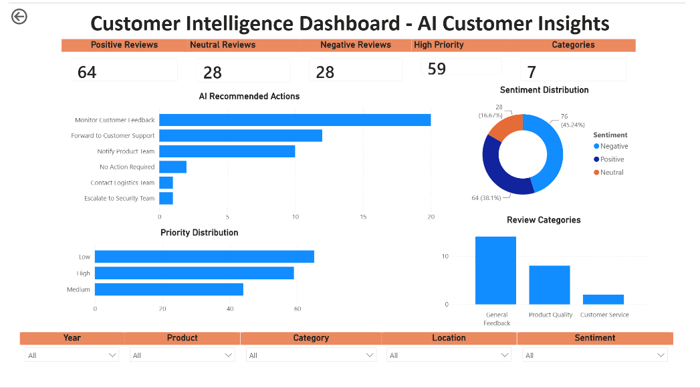

# 🏗️ Solution Architecture

## Overview

The **Fabric AI Customer Intelligence Platform** is an enterprise-grade analytics solution that transforms raw operational data into trusted, AI-enriched business intelligence.

The platform follows Microsoft's recommended **Medallion Architecture**, separating data ingestion, transformation, enrichment and analytical consumption into clearly defined layers. This architecture improves scalability, maintainability, governance and analytical performance while supporting both traditional Business Intelligence and AI-powered customer analytics.

By combining **Microsoft Fabric Data Factory**, **OneLake**, **Lakehouse**, **PySpark**, **Azure AI Foundry (GPT-5)**, **Fabric Warehouse**, **Power BI Semantic Models** and **Deployment Pipelines**, the solution provides a unified enterprise analytics platform.

---

# 🎯 Architecture Principles

The solution is built around the following enterprise design principles:

- Layered Medallion Architecture
- Separation of ingestion, processing and reporting workloads
- Modular and reusable data pipelines
- Centralized enterprise storage using OneLake
- AI enrichment integrated into the trusted data layer
- Enterprise dimensional modelling
- Governed semantic modelling
- Multi-environment deployment
- Source-controlled development

These principles enable the platform to scale while remaining maintainable and extensible.

---

# 🏛️ End-to-End Architecture

  

<i>End-to-end Microsoft Fabric architecture for AI-powered customer analytics.</i>

The platform orchestrates data ingestion, transformation, AI enrichment, analytical modelling and reporting through Microsoft Fabric. Operational data is progressively transformed into trusted enterprise datasets that power executive reporting and AI-driven customer intelligence.

---

# 🥉 Medallion Architecture

The solution implements Microsoft's **Medallion Architecture**, progressively improving data quality as information moves through the Bronze, Silver and Gold layers.

  

<i>Microsoft Fabric Medallion Architecture implemented within the Customer Intelligence Platform.</i>

| Layer | Purpose | Primary Technologies |
|--------|---------|----------------------|
| **Bronze** | Preserve raw operational data and maintain lineage | OneLake, Lakehouse |
| **Silver** | Cleanse, validate, standardize and enrich enterprise data | PySpark, Azure AI Foundry |
| **Gold** | Deliver curated business-ready datasets | Fabric Warehouse, Power BI Semantic Model |

The Medallion Architecture establishes a clear separation between ingestion, engineering and analytical consumption, improving governance, scalability and maintainability.

---

# 🧩 Solution Components

| Layer | Responsibility | Technology |
|--------|----------------|------------|
| **Data Sources** | Operational customer data | CSV, JSON |
| **Data Integration** | Data ingestion & orchestration | Fabric Data Factory |
| **Bronze** | Raw managed data | OneLake Lakehouse |
| **Silver** | Cleansed and validated data | PySpark |
| **AI Enrichment** | GPT-5 customer intelligence | Azure AI Foundry |
| **Gold** | Curated analytical warehouse | Fabric Warehouse |
| **Semantic Layer** | Business relationships & DAX | Power BI Semantic Model |
| **Reporting** | Executive dashboards | Power BI |

---

# 🥉 Bronze Layer

The Bronze layer stores the first managed copy of source data while preserving historical records and supporting data lineage.

Typical operations include:

- Schema validation
- Metadata capture
- Delta conversion
- Ingestion logging

No business transformations are applied at this stage.

---

# 🥈 Silver Layer

The Silver layer prepares trusted enterprise datasets for analytical processing.

Transformation activities include:

- Data cleansing
- Standardization
- Duplicate removal
- Null handling
- Business rule validation
- Feature engineering

This layer produces high-quality datasets suitable for AI enrichment and analytical modelling.

---

# 🤖 AI Enrichment

A key differentiator of the platform is the integration of **Azure AI Foundry (GPT-5)** directly into the engineering pipeline.

Customer reviews are enriched immediately after Silver-layer processing, ensuring AI-generated attributes become reusable enterprise assets rather than report-specific calculations.

Generated business attributes include:

- Sentiment
- Category
- Priority
- Summary
- Keywords
- Recommended Action

The enriched datasets are written back into the Silver Lakehouse before being promoted to the Gold analytical layer, allowing multiple downstream consumers to reuse the same governed AI insights.

---

# 🥇 Gold Layer

The Gold layer is implemented using a **Fabric Warehouse** optimized for enterprise analytics.

The warehouse contains:

- Dimension tables
- Fact tables
- Reporting views
- Stored procedures

A **Galaxy (Fact Constellation) Schema** supports multiple analytical subject areas while sharing common business dimensions.

---

# 🌌 Semantic Model

The Power BI Semantic Model provides a governed analytical layer above the Fabric Warehouse.

Responsibilities include:

- Business relationships
- DAX calculations
- KPI definitions
- Time intelligence
- Interactive filtering

Centralizing business logic within the semantic model ensures analytical consistency across all Power BI reports.

---

# 📊 Business Intelligence

The semantic model powers multiple analytical dashboards.

| Dashboard | Business Focus |
|-----------|----------------|
| 📈 Executive Overview | Revenue, Orders, KPIs and Sales Trends |
| 👥 Customer Feedback | Ratings, Reviews and Customer Engagement |
| 🤖 AI Customer Insights | Sentiment Analysis, Categories, Priorities and Recommendations |

All dashboards consume the same governed semantic model, ensuring consistent KPI definitions and business logic.

## Executive Overview

  

---

## Customer Feedback

  

---

## AI Customer Insights

  

---

# 🚀 Deployment Strategy

The platform supports controlled promotion of Microsoft Fabric artifacts through Deployment Pipelines across:

- Development
- Test
- Production

This deployment strategy enables structured validation while reducing operational risk.

---

# 🔐 Security & Governance

Although the project uses sample data, the architecture follows enterprise governance principles.

Key design considerations include:

- Centralized storage
- Controlled data movement
- Layered architecture
- Governed semantic model
- Environment isolation
- Source-controlled development

The architecture can be extended with:

- Row-Level Security (RLS)
- Sensitivity Labels
- Microsoft Purview
- Incremental Refresh
- Real-Time Analytics

---

# 🎯 Business Value

The architecture enables organizations to:

- Build a trusted Customer 360 platform
- Improve data quality through Medallion Architecture
- Integrate AI directly into enterprise data engineering
- Deliver governed enterprise reporting
- Reuse centralized business logic across multiple analytical solutions
- Scale analytics while maintaining consistency and governance

---

# 📌 Design Summary

The **Fabric AI Customer Intelligence Platform** combines Microsoft Fabric, Azure AI Foundry and Power BI into a unified enterprise analytics solution.

By integrating Data Engineering, Artificial Intelligence, Data Warehousing and Business Intelligence within a governed Medallion Architecture, the platform demonstrates how modern organizations can transform operational data into trusted, AI-powered business insights.

---

# 📚 Related Documentation

- 📖 [Semantic Model](semantic-model.md)
- 🤖 [AI Enrichment](ai-enrichment.md)
- 🚀 [Deployment Strategy](deployment.md)
- ⚙️ [CI/CD & DevOps](cicd.md)
