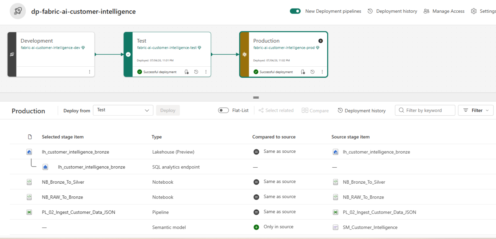

# 🚀 Deployment & DevOps Strategy

## Overview

The **Fabric AI Customer Intelligence Platform** follows a structured deployment strategy using **Microsoft Fabric Deployment Pipelines** to promote analytical assets across **Development**, **Test**, and **Production** workspaces.

Project source code, documentation and supporting artifacts are maintained in **GitHub** and **Azure DevOps**, providing version control, collaboration and traceability throughout the development lifecycle.

This deployment strategy separates development activities from production reporting, ensuring changes are validated before being released to business users.

---

# 🏗️ Deployment Architecture

<p align="center">
  
</p>

<p align="center">
<i>Deployment of Microsoft Fabric assets across Development, Test and Production environments.</i>
</p>

```text
Development Workspace
        │
        ▼
Deployment Pipeline
        │
        ▼
Test Workspace
        │
        ▼
Deployment Pipeline
        │
        ▼
Production Workspace
```

Deployment Pipelines provide controlled promotion of Microsoft Fabric artifacts while maintaining environment isolation.

---

# 🌍 Environment Strategy

| Environment | Purpose |
|-------------|---------|
| **Development** | Build pipelines, notebooks, warehouse objects, semantic models and dashboards |
| **Test** | Validate data, pipelines, AI enrichment and reports before release |
| **Production** | Publish approved analytical assets for business users |

---

# 🔄 Deployment Workflow

```text
Development

        │

        ▼

Technical Validation

        │

        ▼

Deploy to Test

        │

        ▼

Business Validation

        │

        ▼

Deploy to Production
```

This staged promotion process reduces deployment risk while ensuring analytical consistency across environments.

---

# 📦 Fabric Artifacts

The following Microsoft Fabric assets are promoted through the Deployment Pipeline:

- Data Factory Pipelines
- Lakehouses
- PySpark Notebooks
- Fabric Warehouse
- Semantic Model
- Power BI Reports

Each environment maintains the same analytical solution while allowing controlled testing and validation.

---

# ✅ Validation Checklist

Before promoting changes between environments, the following validation activities are performed.

### Data Engineering

- Successful data ingestion
- Record count validation
- Data quality verification

### Data Warehouse

- Dimension tables populated
- Fact tables populated
- SQL views validated
- Stored procedures executed successfully

### Artificial Intelligence

- GPT-5 enrichment completed successfully
- Structured output validated
- Enriched datasets verified

### Business Intelligence

- Semantic model refreshed
- DAX measures validated
- Dashboards rendered successfully
- KPIs verified

---

# 📂 Source Control

GitHub and Azure DevOps provide centralized version control for the project.

Repository assets include:

- SQL scripts
- PySpark notebooks
- Pipeline definitions
- Configuration files
- Documentation
- Sample datasets

Version control supports:

- Change history
- Collaboration
- Documentation
- Backup
- Traceability

---

# 📁 Repository Structure

```text
fabric-ai-customer-intelligence/
│
├── architecture/
├── config/
├── docs/
├── notebooks/
├── pipelines/
├── powerbi/
├── sample-data/
├── screenshots/
├── sql/
├── README.md
└── LICENSE
```

The repository is organized to separate architecture, engineering, analytics and documentation into reusable modules.

---

# 🎯 Current Capability

The current implementation demonstrates:

- Microsoft Fabric Deployment Pipelines
- Environment separation
- Controlled deployment workflow
- GitHub & Azure DevOps version control
- Modular repository organization

---

# 🚀 Future Roadmap

The architecture is designed to support future DevOps enhancements including:

- Microsoft Fabric Git Integration
- Automated CI/CD pipelines
- GitHub Actions or Azure DevOps Pipelines
- Branch protection policies
- Automated testing
- Deployment approvals
- Environment parameterization

These capabilities can be introduced without changing the overall solution architecture.

---

# 📌 Design Summary

The **Fabric AI Customer Intelligence Platform** demonstrates a structured deployment strategy using **Microsoft Fabric Deployment Pipelines** together with centralized source control in **GitHub** and **Azure DevOps**.

By separating Development, Test and Production environments, the solution promotes reliable releases while providing a clear path toward fully automated CI/CD as the platform evolves.

---

# 📚 Related Documentation

- 📖 [Solution Architecture](architecture.md)
- 🌌 [Semantic Model](semantic-model.md)
- 🤖 [AI Enrichment](ai-enrichment.md)
- ⚙️ [CI/CD & DevOps](cicd.md)
