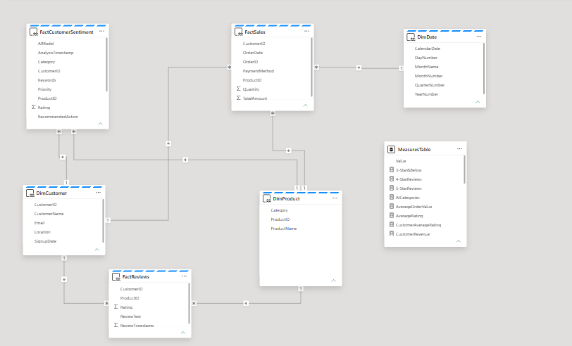

# 📊 Semantic Model

## Overview

The **Fabric AI Customer Intelligence Platform** implements an enterprise **Galaxy (Fact Constellation) Schema** to support multiple analytical subject areas through a single, governed semantic model.

Unlike a traditional Star Schema centered around a single business process, the Galaxy Schema enables multiple fact tables to share common dimensions, allowing sales, customer feedback and AI-generated customer insights to be analyzed together while maintaining consistency across the analytical platform.

This modelling approach provides a scalable foundation for executive reporting, customer analytics and AI-powered business intelligence.

---

# 🎯 Design Objectives

The semantic model was designed to:

- Provide a single source of truth for enterprise reporting
- Support multiple business processes within a unified model
- Enable reusable conformed dimensions
- Simplify DAX calculations
- Improve analytical query performance
- Support AI-enhanced customer analytics
- Enable scalable report development
- Promote consistent business definitions

---

# 🌌 Enterprise Galaxy Schema

<p align="center">
  
</p>

<p align="center">
<i>Enterprise Galaxy Schema implemented within the Power BI Semantic Model.</i>
</p>

The semantic model consists of three shared dimensions supporting three analytical fact tables.

```text
                 DimDate
                    │
                    │
DimCustomer ─── FactSales ─── DimProduct
      │              │              │
      │              │              │
      │         FactReviews ────────┘
      │
      └──── FactCustomerSentiment ──┘

              Measures Table
           (DAX Calculations)
```

This architecture allows multiple analytical subject areas to reuse shared business entities while maintaining clear separation between business processes.

---

# 📐 Dimension Tables

Dimension tables provide descriptive business context for analytical reporting.

| Dimension | Business Purpose | Shared By |
|-----------|------------------|-----------|
| **DimCustomer** | Customer segmentation, reporting and customer intelligence | FactSales, FactReviews, FactCustomerSentiment |
| **DimProduct** | Product analytics, category reporting and product performance | FactSales, FactReviews |
| **DimDate** | Time intelligence, trends and calendar reporting | FactSales, FactReviews, FactCustomerSentiment |

---

# 📊 Fact Tables

Fact tables capture measurable business events.

| Fact Table | Grain | Primary Metrics | Dashboard |
|------------|-------|-----------------|-----------|
| **FactSales** | One row per sales transaction | Revenue, Quantity Sold, Orders | Executive Overview |
| **FactReviews** | One row per customer review | Ratings, Review Count | Customer Feedback |
| **FactCustomerSentiment** | One row per AI-enriched review | Sentiment, Category, Priority, Recommended Action | AI Customer Insights |

---

# 🔗 Relationships

The semantic model uses one-to-many relationships between shared dimensions and analytical fact tables.

```text
DimCustomer
    │
    ├──────── FactSales
    │
    ├──────── FactReviews
    │
    └──────── FactCustomerSentiment

DimProduct
    │
    ├──────── FactSales
    │
    └──────── FactReviews

DimDate
    │
    ├──────── FactSales
    │
    ├──────── FactReviews
    │
    └──────── FactCustomerSentiment
```

This relationship design enables consistent filtering, drill-down and cross-domain analytics.

---

# 📏 Measures Strategy

Business calculations are centralized within a dedicated **Measures Table**, following Microsoft Power BI modelling best practices.

Benefits include:

- Centralized business logic
- Reusable KPI definitions
- Simplified report development
- Improved model organization
- Easier maintenance
- Consistent calculations across reports

Measures are organized into logical business categories:

- **Revenue:** Total Revenue, Orders, Average Order Value, Revenue Growth
- **Customer:** Total Customers, Review Count, Average Rating
- **Product:** Product Revenue, Product Reviews
- **Artificial Intelligence:** Positive, Neutral & Negative Reviews, High Priority Reviews, AI Categories
- **Time Intelligence:** Revenue YTD, Revenue MTD, Previous Month and Previous Year Revenue

All Power BI reports consume the same governed DAX calculations, ensuring analytical consistency across the platform.

---

# ⭐ Why a Galaxy Schema?

A Galaxy Schema was selected instead of a traditional Star Schema because the platform supports multiple analytical domains.

The model combines:

- Sales Analytics
- Customer Feedback Analytics
- AI Customer Intelligence

Each subject area maintains its own fact table while sharing common business dimensions.

This architecture provides:

- Reduced data duplication
- Consistent business definitions
- Better scalability
- Simplified semantic modelling
- Improved maintainability

---

# 🧠 Semantic Layer

The Power BI Semantic Model sits above the Gold Warehouse and provides:

- Business relationships
- DAX calculations
- KPI definitions
- Time intelligence
- Interactive filtering
- Cross-report consistency

All dashboards consume the same governed semantic model.

---

# 📊 Business Intelligence Consumption

The semantic model serves as the governed analytical layer for all reporting. By centralizing relationships, measures and business definitions, every dashboard consumes the same trusted semantic model, ensuring consistent KPIs and analytical logic across the enterprise.

## 📈 Executive Overview

<p align="center">
  
</p>

Provides executive visibility into:

- Revenue and sales performance
- Customer growth
- Customer satisfaction
- Executive KPIs
- Sales trends

---

## 👥 Customer Feedback

<p align="center">
  
</p>

Provides insight into:

- Customer ratings
- Product reviews
- Review trends
- Customer engagement
- Product feedback

---

## 🤖 AI Customer Insights

<p align="center">
  
</p>

Leverages Azure AI Foundry (GPT-5) to deliver:

- Customer sentiment analysis
- Complaint categorization
- Business priority assessment
- AI-generated recommendations
- Customer intelligence

---

# 📈 Business Benefits

The semantic model enables:

- Executive reporting
- Customer analytics
- Product performance analysis
- AI-powered customer intelligence
- Cross-domain reporting
- Enterprise self-service BI

---

# 🚀 Future Enhancements

- Row-Level Security (RLS)
- Object-Level Security (OLS)
- Calculation Groups
- Incremental Refresh
- Composite Models
- Direct Lake
- Real-Time Analytics

---

# 📌 Design Summary

The semantic model was intentionally designed as a **Galaxy (Fact Constellation) Schema** to support multiple analytical domains while maintaining shared business dimensions and consistent enterprise reporting.

By combining dimensional modelling, centralized DAX calculations, reusable business entities and AI-generated customer intelligence, the semantic model provides a scalable foundation for enterprise analytics within Microsoft Fabric.

---

# 📚 Related Documentation

- 📖 [Solution Architecture](architecture.md)
- 🤖 [AI Enrichment](ai-enrichment.md)
- 🚀 [Deployment Strategy](deployment.md)
- ⚙️ [CI/CD & DevOps](cicd.md)
